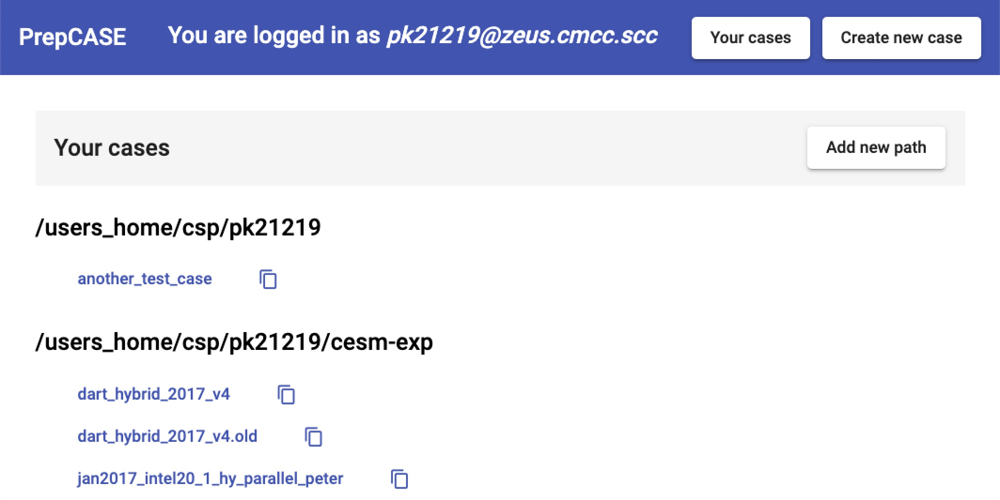
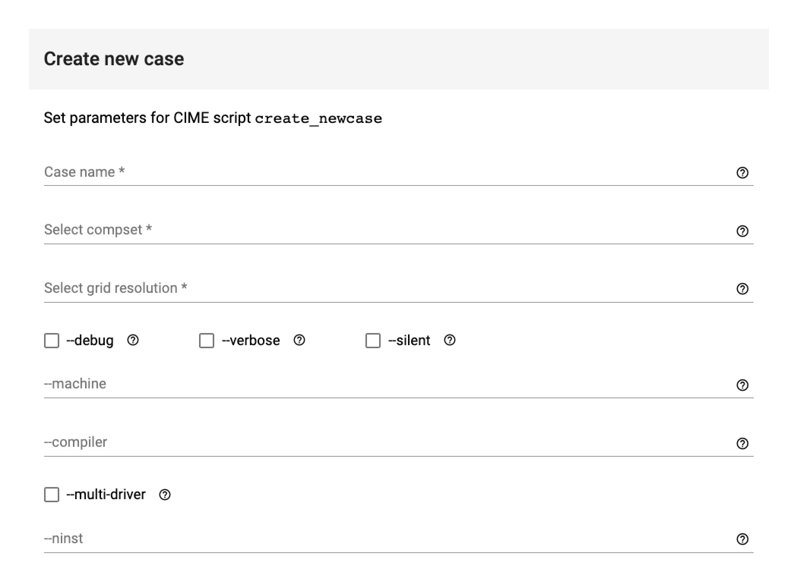
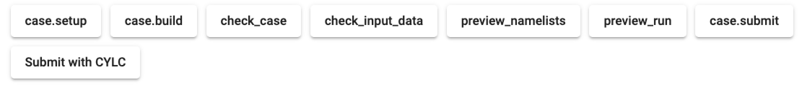
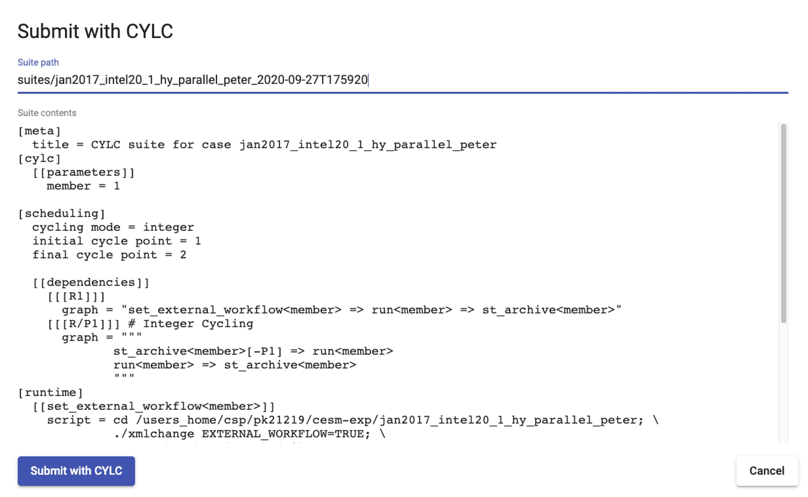
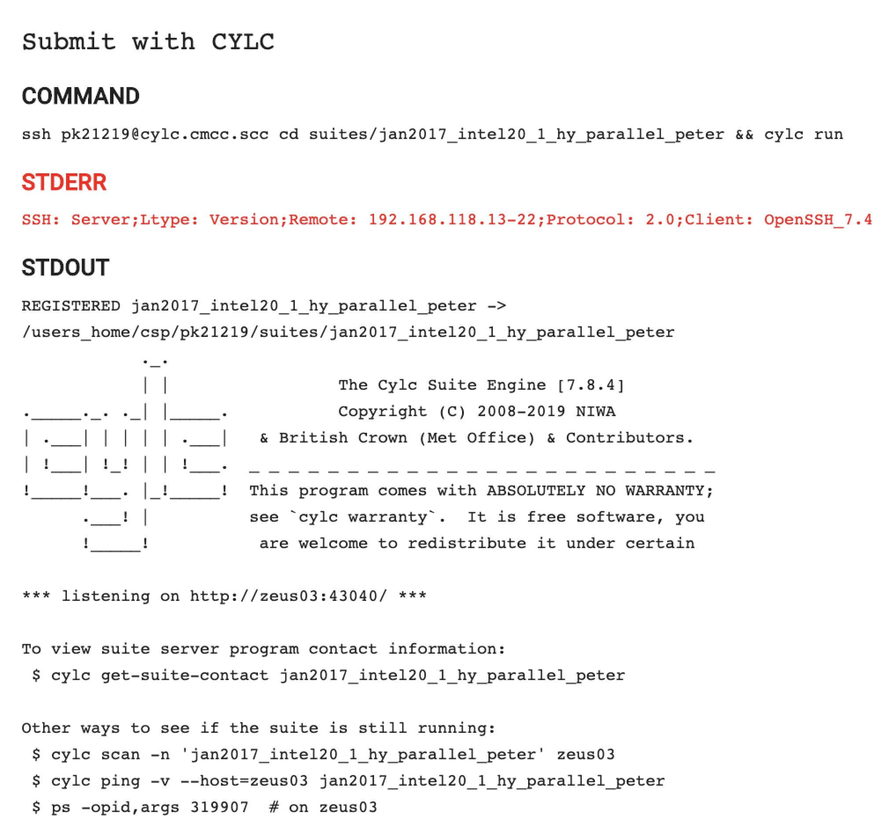
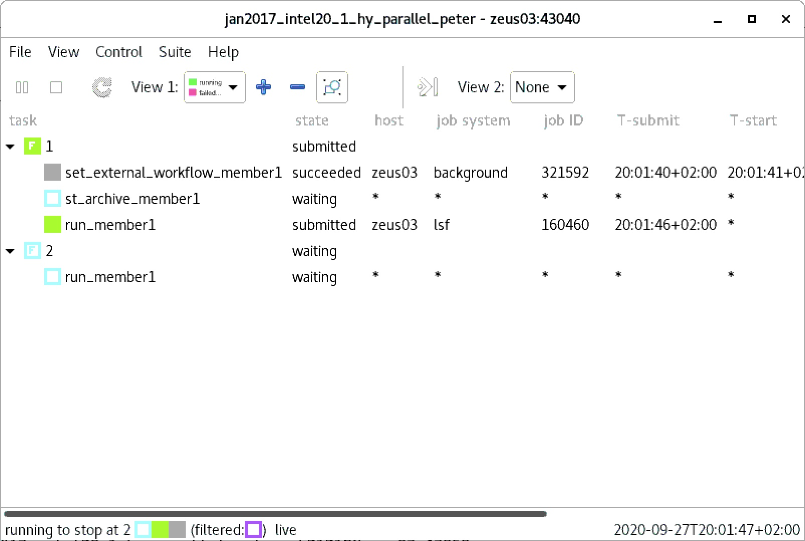

# PrepCASE

PrepCASE is a system developed for [CMCC](https://www.cmcc.it/)
that provides a web based user interface
for creating, configuring, and running Community Earth System Model ([CESM2](http://www.cesm.ucar.edu/models/cesm2/)) climate models.

PrepCASE uses [CIME](https://esmci.github.io/cime/versions/master/html/index.html), Common Infrastructure for Modeling the Earth,
scripts to configure and build a single-executable coupled Earth model,
also called "case" in the CESM terminology, or "experiment".

A CESM case configured and built with PrepCASE
can be run on a supercomputer as a
[CYLC](https://cylc.github.io/) suite.

CYLC is a "general purpose workflow engine that orchestrates cycling workflows very efficiently",
and is used in many meteorological and climatological centres. 

## Managing CESM CASEs with PrepCASE

At CMCC a dedicated Linux VM has been provisioned to
to run PrepCASE server.

After login to the PrepCASE web app
user can create, configure and build CASM cases on the CMCC zeus supercomputer.

### Login to PrepCASE web app

PrepCASE is available to CMCC users at [http://prepcase.cmcc.scc/](http://prepcase.cmcc.scc/) via a VPN,
please contact CMCC calldesk to obtain a VPN account.

PrepCASE at CMCC is configured to manage CESM cases on the zeus supercomputer,
so users must have a zeus account.

PrepCASE executes CIME scripts on zeus over SSH connections.
To allow passwordless SSH connnections from PrepCASE VM to zeus
users must have their SSH keys installed on the PreCASE VM.
This is a one-off action that can be requested from CMCC calldesk.

After obtaining and configuring VPN account on their PC or laptop
and having the SSH keys installed
users have to create a file `.prepcase.json` in their home directory on zeus.
This can be done in zeus shell like below:

```
$ echo >$HOME/.prepcase.json '{ "password": "YOUR_PASSWORD_HERE", "cesm_path": "PATH_TO_CESM", "cesm_env_script": "PATH_TO_ENV_SCRIPT" }'
```

- "password" will be used to login to the PrepCASE web app. It should be different than your password on "zeus.cmcc.scc".
- "cesm\_path" should point to your CESM installation, for example "~/CESM".
- "cesm\_env\_script" is a path to an optional bash script used to set up environment before executing CESM script. Leave empty if not needed.

By default, PrepCASE will show CESM cases in users home directory.
Additional case directory can be added by clicking "Add new path" at "Your cases" screen.
Also, it can be customized by editing entry in `"case\_dirs"` JSON dictionary in `$HOME/.prepcase.json`
with value being a list of directories,
for example:

```
  "case_dirs": [
    "/users_home/csp/john/cesm-exp", 
    "/work/csp/john/cases"
  ]
```

The file `.prepcase.json` should be readable and writable only by your user:

```
$ chmod 600 $HOME/.prepcase.json
```

### Main page

After login to PrepCASE
user is presented with a list of CASEs
in his home directory as well as directories specfied as `"case_dirs"` in `$HOME/.prepcase.json`.



Three main actions are available on the main page:
- creating a new CESM case, by clicking "Create new case" button in the top right corner,
- opening a page with details of a case ("Go to case"), by clicking its name on the list,
- copy case, by clicking an icon on the right hand side of a case. 
This will create a copy of an exiting case that can be later modified as needed,
without changing the original, base case.

You can also add a directory with cases by clicking "Add new path". 

### Creating a new case

After clicking the button "Create new case" on the main page,
user is presented with a page where she can 
set parameters for CIME script [`create_newcase`](https://esmci.github.io/cime/versions/master/html/Tools_user/create_newcase.html).

All parameters and flags of the script, both obligatory and optional, are supported.
Documentation of each parameter and flag is available
upon a click on the small icon with question mark on the left of each option.



### Case page

After clicking a name of a case user will be presented with a page that:
- lists all case variables and their values,
- allows to modify case variables,
- allows to execute CIME scripts in the case directory.

The scripts that can be executed from the case page are:
- [`case.setup`](https://esmci.github.io/cime/versions/master/html/Tools_user/case.setup.html),
- [`case.build`](https://esmci.github.io/cime/versions/master/html/Tools_user/case.build.html),
- [`check_case`](https://esmci.github.io/cime/versions/master/html/Tools_user/check_case.html),
- [`check_input_data`](https://esmci.github.io/cime/versions/master/html/Tools_user/check_input_data.html),
- [`preview_namelists`](https://esmci.github.io/cime/versions/master/html/Tools_user/preview_namelists.html),
- [`preview_run`](https://esmci.github.io/cime/versions/master/html/Tools_user/preview_run.html),
- [`case.submit`](https://esmci.github.io/cime/versions/master/html/Tools_user/case.submit.html).

After clicking a button with a script name
a dialog box appears
where user can set all supported options.
Documentation and default values of optional parameters 
is available via a small icon with question mark on the right hand side of each parameter.

After setting all required parameters
user can execute the script by clicking "Run scripts".

When the script terminates 
its standard output, standard error output as well as an exit code
are shown.

Note, some of the CIME scripts can print warnings to standard error output
and terminate successfully. 

### Submitting case with CYLC

The instructions how to set up VNC connection to CMCC CYLC virtual machine (cylc.cmcc.scc)
are available [here](doc/CYLC7.8.4_@_CMCC_SCC_v.2.2.pdf).

To submit a case with CYLC, user can click "Submit with CYLC" button at the case page:



A dialog will appear where path to CYLC suite can be changed (the default is `suites/<case_name>_<timestamp`),
and the suite itself can be customized.



Clicking "Submit with CYLC" will result in registering the suite with CYLC and submitting it.
 


User can now login to CMCC CYLC virtual machine and open the CYLC GUI.
To do that, execute the command:

```
$ cylc gui <suite_name>
```

where `<suit_name>` is the name of the suite specified earlier (in this example it's `jan2017_intel20_1_hy_parallel_peter`).
If in doubt about the suite name, it can be checked by running `cylc scan` command:

```
$ cylc scan
jan2017_intel20_1_hy_parallel_peter pk21219@zeus03:43040
```

The CYLC GUI should display the running suite:




## PrepCASE developer's documentation

See [DEVELOPMENT.md](DEVELOPMENT.md) for PrepCASE developer's documentation.
